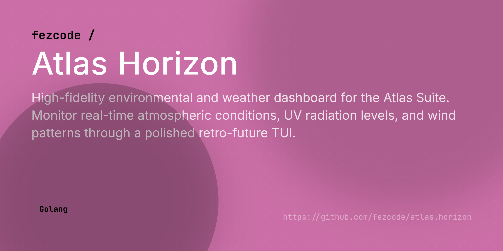

# atlas.horizon 🛰️



**atlas.horizon** is a high-fidelity environmental and weather dashboard for the **Atlas Suite**. It provides real-time atmospheric monitoring, including temperature, humidity, wind patterns, and UV index—which we track as simulated "Radiation Levels" for the wasteland survivor.


## 🔧 Features
- **Real-time Weather:** Powered by Open-Meteo for high accuracy.
- **Rad-Meter (UV Index):** Tracks UV exposure with a "caution" threshold.
- **Wind Radar:** Aesthetic ASCII wind direction and speed monitoring.
- **Location Auto-Detection:** Automatically finds your coordinates via IP.
- **Retro-Future TUI:** Polished Onyx & Gold aesthetic with animations.

## 🚀 Installation
Ensure you have the [Atlas Hub](https://github.com/fezcode/atlas.hub) installed, then:
```bash
atlas.hub install atlas.horizon
```

Or build from source:
```bash
gobake build
```

## ⌨️ Controls
- **'r':** Refresh data manually.
- **'q':** Exit dashboard.
- **'h':** Toggle detailed atmospheric stats.

---
Built with ❤️ by [fezcode](https://github.com/fezcode)
